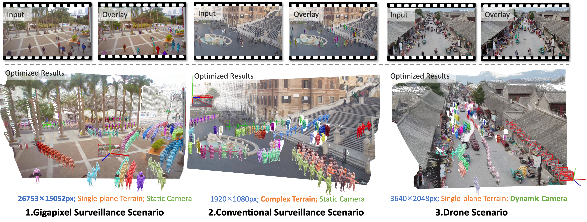
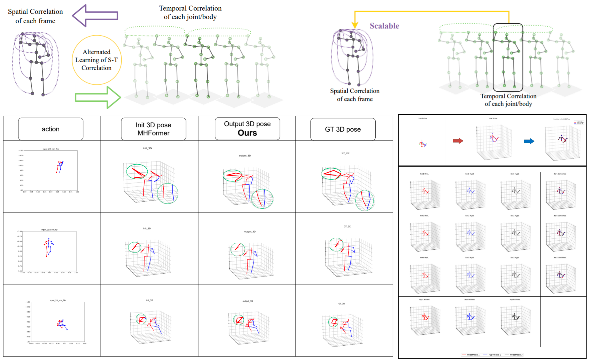
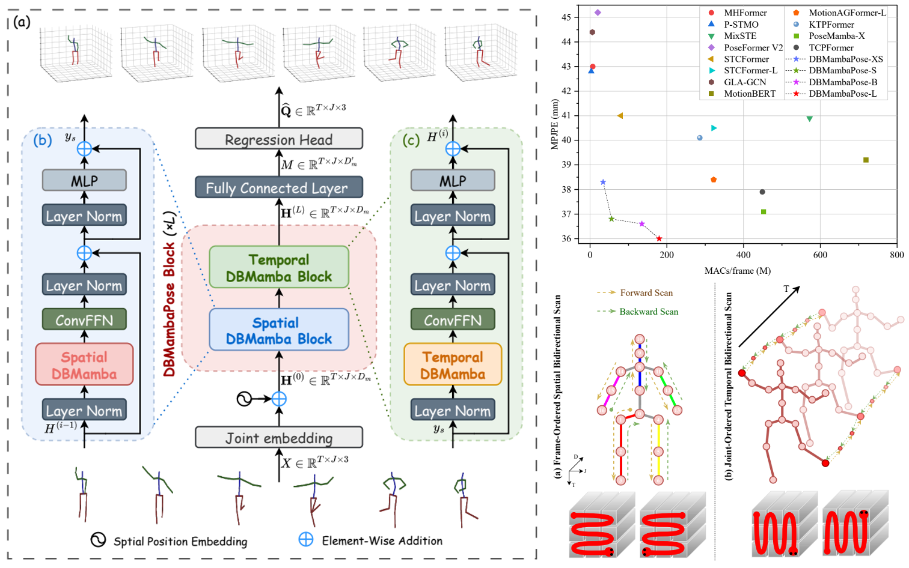
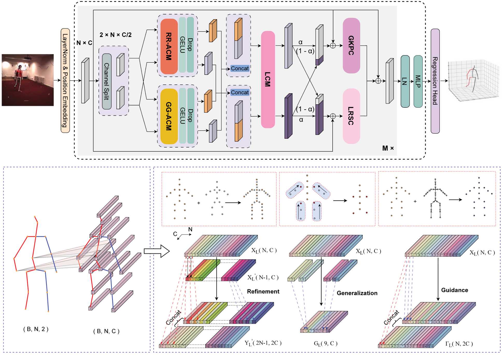
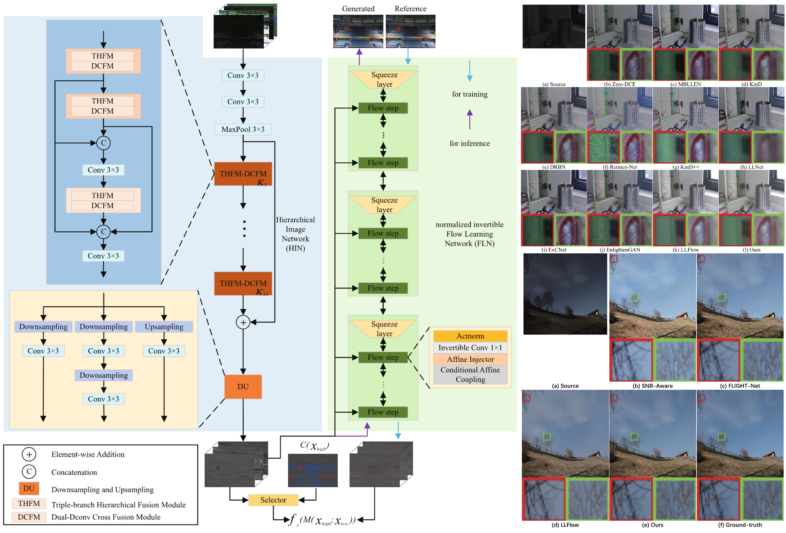








My name is **Hongbo Kang (康洪菠)**. I am a Ph.D. candidate at [Tianjin University](https://en.tju.edu.cn/), advised by Prof. [Kun Li](https://cic.tju.edu.cn/faculty/likun/index.html). I also collaborate closely with Prof. [Yu-Kun Lai](https://yukunlai.github.io/) at Cardiff University. My research focuses on ***human-centered reconstruction and generation***, exploring data-driven methods for perception and decision-making of individuals and crowds. Specifically, it includes: individual and crowd reconstruction, crowd simulation and the construction of virtual crowd datasets, as well as closed-loop simulation of crowds in autonomous driving scenarios.

## 🔥 News
- *2026.05*: &nbsp;🎉 My paper "Crowd4D: Scene-Aware Monocular 4D Crowd Reconstruction" has been accepted to ***ICML***!
- *2026.02*: &nbsp;🎉 Our paper "MuRE: Multi-Relationship Encoder for 3D Human Pose Estimation" has been accepted to ***CVIU***!
- *2026.01*: &nbsp;🎉 Our paper "DRPose: A Diffusion-based Pose Refinement Framework for 3D Human Pose Estimation" has been accepted to ***TCSVT***!
- *2025.12*: &nbsp;🏆 I am honored to be selected for CAST Youth Science and Technology Talent Cultivation Project Doctoral Student Special Program!
- *2025.12*: &nbsp;🎉 Our paper "DBMambaPose: Decoupled Spatial-Temporal Bidirectional State Space Model for Efficient 3D Human Pose Estimation" has been accepted to ***PR***!
- *2025.08*: &nbsp;🎉 My paper "DyCrowd: Towards Dynamic Crowd Reconstruction from a Large-scene Video" has been accepted to ***TPAMI***!
- *2025.07*: &nbsp;🎉 Our paper "RESCUE: Crowd Evacuation Simulation via Controlling SDM-United Characters" has been accepted to ***ICCV*** as Highlight!
- *2025.05*: &nbsp;🎉 My paper "Double-chain Graph Convolution Transformer for 3D Human Pose Estimation" has been accepted to ***TMM***!
- *2024.09*: &nbsp;📌 I started my Ph.D. in Prof. [Kun Li](https://cic.tju.edu.cn/faculty/likun/index.html)'s team at Tianjin University.
- ...

## 📝 Publications 

- **Selected Publications** (\* Co-first author, ✉️ Corresponding author)

<!-- Crowd4D -->

ICML

[**Crowd4D: Scene-Aware Monocular 4D Crowd Reconstruction**](https://icml.cc/virtual/2026/poster/65335)

**Hongbo Kang**, Tianyi Zhou, Qingyang Yang, Hongwei Wen, Jing Huang, Yu-Kun Lai, Kun Li✉️

{% include expandable_abstract.html abstract="Recovering scene-consistent 4D crowd motion from monocular video in large-scale scenes remains challenging due to severe depth ambiguity and complex scene geometry. Existing monocular crowd reconstruction methods typically rely on single-plane assumptions, leading to unreliable metric scale and spatial drift under complex terrain. We propose Crowd4D, the first scene-aware 4D crowd reconstruction framework that jointly optimizes the crowd and scene from a monocular RGB video in large-scale scenes. Crowd4D explicitly incorporates scene geometry and ensures consistency across image and scene spaces via a multi-stage optimization strategy. A key bottleneck of this task lies in accurate human–scene alignment, particularly in scale and position. However, human and scene reconstructions are typically decoupled. To address this, we introduce the Human–Scene Interaction Proxy (HSIP) as an intermediate representation, derived from Scene Interaction Point Clouds and a Scene Interaction Surface (SIPC\&SIS), which encode explicit scene-aware geometric priors and redefine the optimization space for large-scale monocular 4D crowd reconstruction. To further improve temporal stability under occlusions, we introduce Crowd Structural Coherence Regularization (CSCR), which leverages HSIP-based spatial priors to impose soft temporal consistency on pairwise relative displacements and directions within local crowd neighborhoods. Extensive experiments demonstrate that Crowd4D consistently outperforms existing state-of-the-art methods and enables robust monocular 4D crowd reconstruction in complex, large-scale real-world scenes." %}

***International Conference on Machine Learning***, 2026 CCF-A [**\[Project Page \]**](https://cic.tju.edu.cn/faculty/likun/projects/Crowd4D/index.html)[**\[Code\]**](https://github.com/KHB1698/Crowd4D) <strong></strong>

<!-- DRPose -->

TCSVT

[**DRPose: A Diffusion-based Pose Refinement Framework for 3D Human Pose Estimation**]()

Yong Wang\*, Xuguang Liu\*, Xiaoqing Wang, Doudou Wu, Wenming Yang, **Hongbo Kang**✉️

{% include expandable_abstract.html abstract="Recently, two-stage 3D human pose estimation using monocular cameras has gained significant attention. However, the inherent uncertainty in the upscaling process from 2D to 3D often compromises the accuracy of deterministic methods. To address this, we propose a novel diffusion-based refinement framework (DRPose) which models the uncertainty during the upscaling process by introducing stochastic noise to the initially predicted 3D poses. This approach facilitates the generation of more realistic predictions through iterative refinement with multiple noise samples, ultimately producing multi-hypothesis predictions that better align with ground truth. Our framework incorporates two key components: a Graph Convolution Transformer module (SGCT), which integrates scaling and displacement adjustments based on conditional information with a joint temporal-spatial feature separation mechanism, and a Pose Refinement Module (PRM), which balances the initial and refined poses. This design allows DRPose to effectively refine pose estimation for both individual frames and sequential data. Furthermore, our framework establishes new benchmarks for performance in both frame2frame and seq2frame scenarios. Extensive experiments demonstrate that our method achieves state-of-the-art performance on the Human3.6M and MPI-INF-3DHP datasets. Notably, when applied to the current state-of-the-art single-frame 3D pose extractor, our multi-hypothesis optimization achieves an 18.8% reduction in Mean Per Joint Position Error (MPJPE) and a 16.9% reduction in Procrustes MPJPE (P-MPJPE)." %}

***IEEE Transactions on Circuits and Systems for Video Technology***, 2026 CCF-B [**\[Code\]**](https://github.com/KHB1698/DRPose) <strong></strong>

<!-- DyCrowd -->

TPAMI

[**DyCrowd: Towards Dynamic Crowd Reconstruction from a Large-scene Video**](https://arxiv.org/abs/2508.12644v1)

Hao Wen\*, **Hongbo Kang\***, Jian Ma, Jing Huang, Yuanwang Yang, Haozhe Lin, Yu-Kun Lai, Kun Li✉️

{% include expandable_abstract.html abstract="3D reconstruction of dynamic crowds in large scenes has become increasingly important for applications such as city surveillance and crowd analysis. However, current works attempt to reconstruct 3D crowds from a static image, causing a lack of temporal consistency and inability to alleviate the typical impact caused by occlusions. In this paper, we propose DyCrowd, the first framework for spatio-temporally consistent 3D reconstruction of hundreds of individuals' poses, positions and shapes from a large-scene video." %}

***IEEE Transactions on Pattern Analysis and Machine Intelligence***, 2025 CCF-A [**\[Project Page \]**](https://cic.tju.edu.cn/faculty/likun/projects/DyCrowd/index.html)[**\[Code\]**](https://github.com/KHB1698/DyCrowd) <strong></strong>

<!-- RESCUE -->

ICCV

[**RESCUE: Crowd Evacuation Simulation via Controlling SDM-United Characters**](https://arxiv.org/abs/2507.20117)

Xiaolin Liu\*, Tianyi Zhou\*, **Hongbo Kang**, Jian Ma, Ziwen Wang, Jing Huang, Wenguo Weng, Yu-Kun Lai, Kun Li✉️

{% include expandable_abstract.html abstract="Crowd evacuation simulation is critical for enhancing public safety, and demanded for realistic virtual environments. However, existing methods fail to generate reasonable, personalized and real-time evacuation motions. In this paper, aligned with the sensory-decision-motor (SDM) flow of the human brain, we propose a real-time 3D crowd evacuation simulation framework that integrates a 3D-adaptive SFM (Social Force Model) Decision Mechanism and a Personalized Gait Control Motor. This framework allows multiple agents to move in parallel and is suitable for various scenarios, with dynamic crowd awareness. Additionally, we introduce Part-level Force Visualization to assist in evacuation analysis." %}

***International Conference on Computer Vision***, 2025 CCF-A Highlight [**\[Project Page \]**](https://cic.tju.edu.cn/faculty/likun/projects/RESCUE/index.html)[**\[Code\]**](https://github.com/xiaolin0314/RESCUE) <strong></strong>

<!-- DC-GCT -->

TMM

[**Double-chain Graph Convolution Transformer for 3D Human Pose Estimation**](https://arxiv.org/abs/2308.05298)

***Hongbo Kang***, Yong Wang✉️, Mengyuan Liu, Doudou Wu, Peng Liu, Wenming Yang

{% include expandable_abstract.html abstract="Reconstructing 3D poses from 2D poses lacking depth information is particularly challenging due to the complexity and diversity of human motion. The key is to effectively model the spatial constraints between joints to leverage their inherent dependencies. Thus, we propose a novel model, called Double-chain Graph Convolutional Transformer (DC-GCT), to constrain the pose through a double-chain design consisting of local-to-global and global-to-local chains to obtain a complex representation more suitable for the current human pose. Specifically, we combine the advantages of GCN and Transformer and design a Local Constraint Module (LCM) based on GCN and a Global Constraint Module (GCM) based on self-attention mechanism as well as a Feature Interaction Module (FIM). The proposed method fully captures the multi-level dependencies between human body joints to optimize the modeling capability of the model. Moreover, we propose a method to use temporal information into the single-frame model by guiding the video sequence embedding through the joint embedding of the target frame, with negligible increase in computational cost." %}

***IEEE Transactions on Multimedia***, 2025 CCF-A [**\[Code\]**](https://github.com/KHB1698/DC-GCT) <strong></strong>

<!-- DRPose -->

ICASSP

[**Diffusion-based Pose Refinement and Multi-Hypothesis Generation for 3D Human Pose Estimation**](https://arxiv.org/abs/2401.04921)

**Hongbo Kang**, Yong Wang✉️, Mengyuan Liu, Doudou Wu, Peng Liu, Xinlin Yuan, Wenming Yang

{% include expandable_abstract.html abstract="Previous probabilistic models for 3D Human Pose Estimation (3DHPE) aimed to enhance pose accuracy by generating multiple hypotheses. However, most of the hypotheses generated deviate substantially from the true pose. Compared to deterministic models, the excessive uncertainty in probabilistic models leads to weaker performance in single-hypothesis prediction. To address these two challenges, we propose a diffusion-based refinement framework called DRPose, which refines the output of deterministic models by reverse diffusion and achieves more suitable multi-hypothesis prediction for the current pose benchmark by multi-step refinement with multiple noises. To this end, we propose a Scalable Graph Convolution Transformer (SGCT) and a Pose Refinement Module (PRM) for denoising and refining." %}

***International Conference on Acoustics, Speech, and Signal Processing***, 2024 CCF-B [**\[Code\]**](https://github.com/KHB1698/DRPose) <strong></strong>

<!-- GLSTE -->

TMM

[**Global and local spatio-temporal encoder for 3D human pose estimation**](https://ieeexplore.ieee.org/abstract/document/10269070)

Yong Wang\*, **Hongbo Kang\*✉️**, Doudou Wu, Wenming Yang, Longbin Zhang

{% include expandable_abstract.html abstract="Transformers have been used for 3D human pose estimation with excellent performance; however, most transformers focus on encoding the global spatio-temporal correlation of all joints in the human body and there are few studies on the local Spatio-temporal correlation of each joint in the human body. In this article, we propose a Global and Local Spatio-Temporal Encoder (GLSTE) to model the Spatio-temporal correlation. Specifically, a Global Spatial Encoder (GSE) and a Global Temporal Encoder (GTE) are constructed to capture the global spatial information of all joints in a single frame and the global temporal information of all frames, respectively. A Local Spatio-Temporal Encoder (LSTE) is constructed to capture the spatial and temporal information of each joint in the local N frames. Furthermore, we propose a parallel attention module with weight sharing to better incorporate spatial and temporal information into each node simultaneously." %} 

***IEEE Transactions on Multimedia***, 2023 CCF-A

- **Other Publications**
<!-- \* Co-first author, ✉️ Corresponding author -->

<!-- MuRE -->

CVIU [**MuRE: Multi-Relationship Encoder for 3D Human Pose Estimation**](https://www.sciencedirect.com/science/article/abs/pii/S1077314226000743)

Yong Wang, Doudou Wu, **Hongbo Kang**, Peng Liu, Wenming Yang✉️

{% include expandable_abstract.html abstract="In the mission of 2D-to-3D lifting for human pose estimation, the self-attention mechanism has demonstrated remarkable efficacy in capturing global interdependencies among joints. However, the attention matrix generated by the Query and Key, derived from the mapping of joint features, exclusively captures implicit spatial relationships among these features. In this paper, we propose that integrating the physical topological relationships of the human body and the explicit spatial relationships among the joints can enhance the overall representational capacity. Therefore, we introduce an Adaptive Multi-Relationship Attention (AMuRA), which adaptively captures diverse global relationships among human body joints by incorporating the joint Self-Similarity Matrix (SSM) and predefined skeleton adjacency matrix into the traditional attention mechanism. Additionally, graph convolutional networks (GCNs) can capture local representations between adjacent joints. By combining AMuRA with the GCN Block, we propose a Multi-Relationship Encoder (MuRE) that captures multi-layer dependencies among human body joints through a global-to-local architecture." %}

***Computer Vision and Image Understanding***, 2026 CCF-B

<!-- DBMambaPose -->
<!-- 

PR

 -->

PR [**DBMambaPose: Decoupled Spatial-Temporal Bidirectional State Space Model for Efficient 3D Human Pose Estimation**]()

Xiaoqing Wang\*, Yong Wang\*, Xuguang Liu, **Hongbo Kang**, Wenming Yang✉️

{% include expandable_abstract.html abstract="Transformer-based 3D human pose estimation (HPE) methods face efficiency-accuracy trade-offs due to self-attention’s quadratic complexity. While State Space Models (SSMs) offer linear complexity and strong long-range modeling, direct Mamba adaptation to video-based 3D HPE is suboptimal, as unidirectional SSMs poorly capture spatio-temporal context. To address this, we propose DBMambaPose, a novel attention-free 3D HPE architecture based on SSMs. Its core DBMambaPose Block alternately stacks Spatial Disentangled Bidirectional Mamba Block (S-DBMB) for intra-frame joint spatial dependencies and Temporal Disentangled Bidirectional Mamba Block (T-DBMB) for inter-frame joint motion trajectories. We further introduce a Decoupled Spatial-Temporal Bidirectional Scanning mechanism (DST-BS) to enable frame-ordered spatial bidirectional processing and joint-ordered temporal bidirectional processing, enhancing fine-grained spatio-temporal feature modeling. Four DBMambaPose variants provide flexible accuracy-efficiency trade-offs. Experiments on Human3.6M and MPI-INF-3DHP show DBMambaPose achieves state-of-the-art performance with reduced computational costs." %} 

***Pattern Recognition***, 2026 CCF-B [**\[Code\]**](https://github.com/camelliawxq/DBMambaPose)

<!-- ICFNet -->
<!-- 

Neurocomputing

 -->

Neurocomputing [**ICFNet: Interactive-complementary fusion network for monocular 3D human pose estimation**](https://www.sciencedirect.com/science/article/abs/pii/S0925231224017181)

Yong Wang\*, Peng Liu\*✉️, **Hongbo Kang**, Doudou Wu, Duoqian Miao

{% include expandable_abstract.html abstract="Most existing methods for 3D human pose estimation from monocular images focus on learning the spatial correlation of either the global or local joints of the human body but fail to adequately capture the inherent dependencies between them. To address this limitation, we propose the Interactive Complementary Fusion Network (ICFNet), an algorithm designed to fully utilize the prior knowledge of both global and local joint relationships to enhance prediction performance. Specifically, we introduce two feature capturers: the Global Knowledge Prior Capturer (GKPC) and the Local Region Subject Capturer (LRSC), which respectively capture global body knowledge and local joint information. Additionally, we propose three joint constraint mechanisms to express the potential association dependencies between global and local joints, which are further modeled using two association capturers: the Refined-Regression Association Capture Module (RR-ACM) and the Generalized-Guidance Association Capture Module (GG-ACM). Moreover, we introduce a novel feature transformation module, the Link Conversion Module (LCM), to transform and augment pose features. The algorithm adopts a complementary process to enhance the interaction and fusion of global and local feature information by gradually imposing constraints on the physical topological features of the human body, thereby improving its modeling capabilities. Extensive experiments demonstrate that our proposed ICFNet achieves state-of-the-art results on two challenging benchmark datasets: Human 3.6M and MPI-INF-3DHP." %}

***Neurocomputing***, 2025 CCF-C [**\[Code\]**](https://github.com/PENG-LAU/ICFNet)

<!-- HFL -->
<!-- 

DCN

 -->

DCN [**Hierarchical flow learning for low-light image enhancement**](https://www.sciencedirect.com/science/article/pii/S2352864824001585)

Xinlin Yuan, Yong Wang, Yan Li, **Hongbo Kang**, Yu Chen, Boran Yang

{% include expandable_abstract.html abstract="Low-light images often have defects such as low visibility, low contrast, high noise, and high color distortion compared with well-exposed images. If the low-light region of an image is enhanced directly, the noise will inevitably blur the whole image. Besides, according to the retina-and-cortex (retinex) theory of color vision, the reflectivity of different image regions may differ, limiting the enhancement performance of applying uniform operations to the entire image. Therefore, we design a Hierarchical Flow Learning (HFL) framework, which consists of a Hierarchical Image Network (HIN) and a normalized invertible Flow Learning Network (FLN). HIN can extract hierarchical structural features from low-light images, while FLN maps the distribution of normally exposed images to a Gaussian distribution using the learned hierarchical features of low-light images. In subsequent testing, the reversibility of FLN allows inferring and obtaining enhanced low-light images. Specifically, the HIN extracts as much image information as possible from three scales, local, regional, and global, using a Triple-branch Hierarchical Fusion Module (THFM) and a Dual-Dconv Cross Fusion Module (DCFM). The THFM aggregates regional and global features to enhance the overall brightness and quality of low-light images by perceiving and extracting more structure information, whereas the DCFM uses the properties of the activation function and local features to enhance images at the pixel-level to reduce noise and improve contrast. In addition, in this paper, the model was trained using a negative log-likelihood loss function. Qualitative and quantitative experimental results demonstrate that our HFL can better handle many quality degradation types in low-light images compared with state-of-the-art solutions. The HFL model enhances low-light images with better visibility, less noise, and improved contrast, suitable for practical scenarios such as autonomous driving, medical imaging, and nighttime surveillance. Outperforming them by PSNR = 27.26 dB, SSIM = 0.93, and LPIPS = 0.10 on benchmark dataset LOL-v1." %}

***Digital Communications and Networks***, 2024

<!-- # 🚀 Projects

<!-- 你可以在这里添加你的项目 -->

## 🎖 Awards
- *2025.12* CAST Youth Science and Technology Talent Cultivation Project Doctoral Student Special Program
- *2024.06* Outstanding Graduate Student of Chongqing (Top 1%)
- *2023.10* National Scholarship (Top 1%)
- *2021.10* PaddlePaddle Developers Experts (PPDE) [**\[AI Studio\]**](https://aistudio.baidu.com/personalcenter/thirdview/791590)

## 🎓 Academic Service
- **Reviewer**: IJCV, TMM, TCSVT, PR, MM, etc.

<!-- # 📖 Educations
- *2019.06 - 2022.04 (now)*, Lorem ipsum dolor sit amet, consectetur adipiscing elit. Vivamus ornare aliquet ipsum, ac tempus justo dapibus sit amet. 
- *2015.09 - 2019.06*, Lorem ipsum dolor sit amet, consectetur adipiscing elit. Vivamus ornare aliquet ipsum, ac tempus justo dapibus sit amet. 

# 💬 Invited Talks
- *2021.06*, Lorem ipsum dolor sit amet, consectetur adipiscing elit. Vivamus ornare aliquet ipsum, ac tempus justo dapibus sit amet. 
- *2021.03*, Lorem ipsum dolor sit amet, consectetur adipiscing elit. Vivamus ornare aliquet ipsum, ac tempus justo dapibus sit amet.  \| [\[video\]](https://github.com/)

# 💻 Internships
- *2019.05 - 2020.02*, [Lorem](https://github.com/), China. -->

