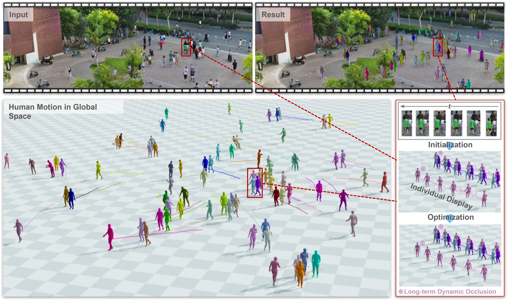
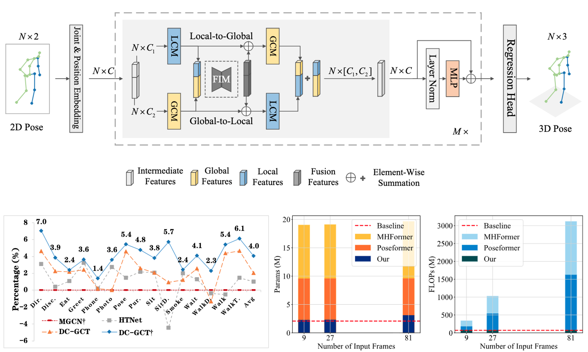
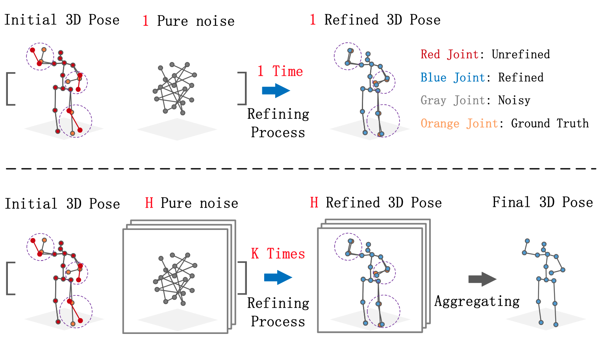
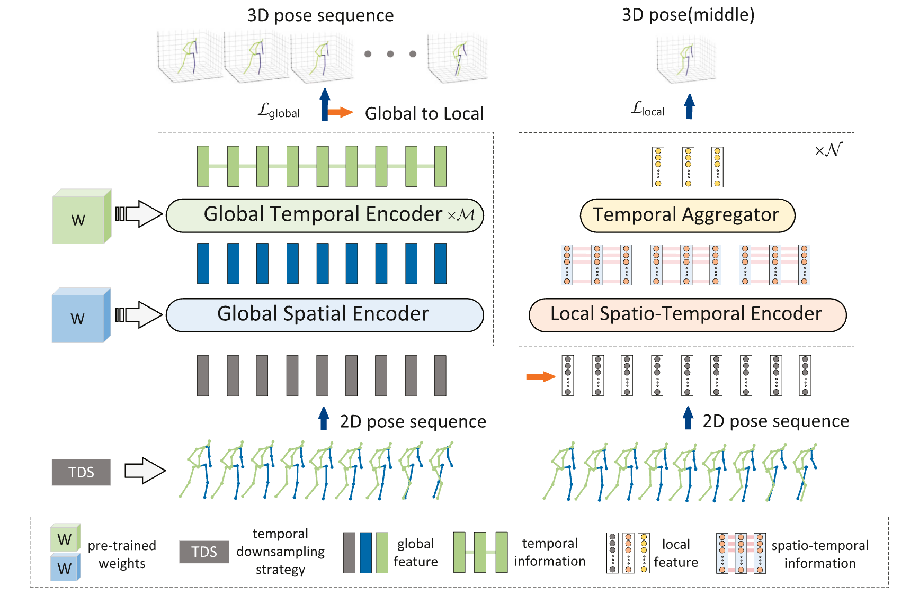








Hi! I’m Hongbo Kang (康洪菠), a Ph.D. candidate at [Tianjin University](https://en.tju.edu.cn/) supervised by Prof. [Kun Li](https://cic.tju.edu.cn/faculty/likun/index.html). I also maintain a long-term research collaboration with Prof. [Yu-Kun Lai](https://users.cs.cf.ac.uk/Yukun.Lai/) from Cardiff University. I received my Master’s degree from Chongqing University of Technology, where I was jointly supervised by Prof. Yong Wang and Prof. [Wenming Yang](https://www.sigs.tsinghua.edu.cn/ywm/list.htm) from Tsinghua University. I completed my undergraduate studies at Jishou University. My research focuses on 3D vision, specifically human-related motion reconstruction and generation. 
<!-- Hi! I’m Hongbo Kang (康洪菠), a Ph.D. candidate at [Tianjin University](https://en.tju.edu.cn/) supervised by Prof. [Kun Li](https://cic.tju.edu.cn/faculty/likun/index.html). I also maintain a long-term research collaboration with Prof. [Yu-Kun Lai](https://users.cs.cf.ac.uk/Yukun.Lai/) from Cardiff University. My research focuses on 3D vision, specifically human-related motion reconstruction and generation. -->
<!-- If you are seeking any form of academic collaboration, please contact me at [hbkang@tju.edu.cn](mailto:hbkang@tju.edu.cn). -->
> 🕒 This page was last updated in Sep 2025.
<!-- My research interest includes neural machine translation and computer vision. I have published more than 100 papers at the top international AI conferences with total <a href='https://scholar.google.com/citations?user=DhtAFkwAAAAJ'>google scholar citations <strong>260000+</strong></a> (You can also use google scholar badge ). -->

# 🔥 News
- *2025.08*: &nbsp;🎉 One paper accepted to TPAMI 2025.
- *2025.07*: &nbsp;🎉 One paper accepted to ICCV 2025.
- *2025.05*: &nbsp;🎉 One paper accepted to TMM 2025.
- *2024.09*: &nbsp;📌 I started my Ph.D. in Prof. [Kun Li](https://cic.tju.edu.cn/faculty/likun/index.html)'s team at Tianjin University.
- ...

# 📝 Publications 
\* Co-first author, ✉️ Corresponding author.
<!-- DyCrowd -->

TPAMI

[**DyCrowd: Towards Dynamic Crowd Reconstruction from a Large-scene Video**](https://arxiv.org/abs/2508.12644v1)

Hao Wen\*, **Hongbo Kang\***, Jian Ma, Jing Huang, Yuanwang Yang, Haozhe Lin, Yu-Kun Lai, Kun Li✉️

{% include expandable_abstract.html abstract="3D reconstruction of dynamic crowds in large scenes has become increasingly important for applications such as city surveillance and crowd analysis. However, current works attempt to reconstruct 3D crowds from a static image, causing a lack of temporal consistency and inability to alleviate the typical impact caused by occlusions. In this paper, we propose DyCrowd, the first framework for spatio-temporally consistent 3D reconstruction of hundreds of individuals' poses, positions and shapes from a large-scene video." %}

**IEEE Transactions on Pattern Analysis and Machine Intelligence**, 2025 [**\[Project Page \]**](https://cic.tju.edu.cn/faculty/likun/projects/DyCrowd/index.html)[**\[Code\]**](https://github.com/KHB1698/DyCrowd) <strong></strong>

<!-- RESCUE -->

ICCV

[**RESCUE: Crowd Evacuation Simulation via Controlling SDM-United Characters**](https://arxiv.org/abs/2507.20117)

Xiaolin Liu\*, Tianyi Zhou\*, **Hongbo Kang**, Jian Ma, Ziwen Wang, Jing Huang, Wenguo Weng, Yu-Kun Lai, Kun Li✉️

{% include expandable_abstract.html abstract="Crowd evacuation simulation is critical for enhancing public safety, and demanded for realistic virtual environments. However, existing methods fail to generate reasonable, personalized and real-time evacuation motions. In this paper, aligned with the sensory-decision-motor (SDM) flow of the human brain, we propose a real-time 3D crowd evacuation simulation framework that integrates a 3D-adaptive SFM (Social Force Model) Decision Mechanism and a Personalized Gait Control Motor. This framework allows multiple agents to move in parallel and is suitable for various scenarios, with dynamic crowd awareness. Additionally, we introduce Part-level Force Visualization to assist in evacuation analysis." %}

**International Conference on Computer Vision**, 2025 (Highlight) [**\[Project Page \]**](https://cic.tju.edu.cn/faculty/likun/projects/RESCUE/index.html)[**\[Code\]**](https://github.com/xiaolin0314/RESCUE) <strong></strong>

<!-- DC-GCT -->

TMM

[**Double-chain Graph Convolution Transformer for 3D Human Pose Estimation**](https://arxiv.org/abs/2308.05298)

**Hongbo Kang**, Yong Wang✉️, Mengyuan Liu, Doudou Wu, Peng Liu, Wenming Yang

{% include expandable_abstract.html abstract="Reconstructing 3D poses from 2D poses lacking depth information is particularly challenging due to the complexity and diversity of human motion. The key is to effectively model the spatial constraints between joints to leverage their inherent dependencies. Thus, we propose a novel model, called Double-chain Graph Convolutional Transformer (DC-GCT), to constrain the pose through a double-chain design consisting of local-to-global and global-to-local chains to obtain a complex representation more suitable for the current human pose. Specifically, we combine the advantages of GCN and Transformer and design a Local Constraint Module (LCM) based on GCN and a Global Constraint Module (GCM) based on self-attention mechanism as well as a Feature Interaction Module (FIM). The proposed method fully captures the multi-level dependencies between human body joints to optimize the modeling capability of the model. Moreover, we propose a method to use temporal information into the single-frame model by guiding the video sequence embedding through the joint embedding of the target frame, with negligible increase in computational cost." %}

**IEEE Transactions on Multimedia**, 2025 [**\[Code\]**](https://github.com/KHB1698/DC-GCT) <strong></strong>

<!-- DRPose -->

ICASSP

[**Diffusion-based Pose Refinement and Multi-Hypothesis Generation for 3D Human Pose Estimation**](https://arxiv.org/abs/2401.04921)

**Hongbo Kang**, Yong Wang✉️, Mengyuan Liu, Doudou Wu, Peng Liu, Xinlin Yuan, Wenming Yang

{% include expandable_abstract.html abstract="Previous probabilistic models for 3D Human Pose Estimation (3DHPE) aimed to enhance pose accuracy by generating multiple hypotheses. However, most of the hypotheses generated deviate substantially from the true pose. Compared to deterministic models, the excessive uncertainty in probabilistic models leads to weaker performance in single-hypothesis prediction. To address these two challenges, we propose a diffusion-based refinement framework called DRPose, which refines the output of deterministic models by reverse diffusion and achieves more suitable multi-hypothesis prediction for the current pose benchmark by multi-step refinement with multiple noises. To this end, we propose a Scalable Graph Convolution Transformer (SGCT) and a Pose Refinement Module (PRM) for denoising and refining." %}

**International Conference on Acoustics, Speech, and Signal Processing**, 2024 [**\[Code\]**](https://github.com/KHB1698/DRPose) <strong></strong>

<!-- GLSTE -->

TMM

[**Global and local spatio-temporal encoder for 3D human pose estimation**](https://ieeexplore.ieee.org/abstract/document/10269070)

Yong Wang\*, **Hongbo Kang\*✉️**, Doudou Wu, Wenming Yang, Longbin Zhang

{% include expandable_abstract.html abstract="Transformers have been used for 3D human pose estimation with excellent performance; however, most transformers focus on encoding the global spatio-temporal correlation of all joints in the human body and there are few studies on the local Spatio-temporal correlation of each joint in the human body. In this article, we propose a Global and Local Spatio-Temporal Encoder (GLSTE) to model the Spatio-temporal correlation. Specifically, a Global Spatial Encoder (GSE) and a Global Temporal Encoder (GTE) are constructed to capture the global spatial information of all joints in a single frame and the global temporal information of all frames, respectively. A Local Spatio-Temporal Encoder (LSTE) is constructed to capture the spatial and temporal information of each joint in the local N frames. Furthermore, we propose a parallel attention module with weight sharing to better incorporate spatial and temporal information into each node simultaneously." %} 

**IEEE Transactions on Multimedia** , 2023

<!-- ICFNet -->

[**ICFNet: Interactive-complementary fusion network for monocular 3D human pose estimation**](https://www.sciencedirect.com/science/article/abs/pii/S0925231224017181)

Yong Wang, Peng Liu, **Hongbo Kang**, Doudou Wu, Duoqian Miao

**Neurocomputing**, 2025

<!-- HIN -->

[**Hierarchical flow learning for low-light image enhancement**](https://www.sciencedirect.com/science/article/pii/S2352864824001585)

Xinlin Yuan, Yong Wang, Yan Li, **Hongbo Kang**, Yu Chen, Boran Yang

**Digital Communications and Networks**, 2024

# 🎖 Honors and Awards
- *2024.06* Outstanding Graduate Student of Chongqing (Top 1%)
- *2023.10* National Scholarship (Top 1%)

# 🎓 Academic Service
- Reviewer: TMM, TCSVT, PR, ACMMM, etc.

<!-- # 📖 Educations
- *2019.06 - 2022.04 (now)*, Lorem ipsum dolor sit amet, consectetur adipiscing elit. Vivamus ornare aliquet ipsum, ac tempus justo dapibus sit amet. 
- *2015.09 - 2019.06*, Lorem ipsum dolor sit amet, consectetur adipiscing elit. Vivamus ornare aliquet ipsum, ac tempus justo dapibus sit amet. 

# 💬 Invited Talks
- *2021.06*, Lorem ipsum dolor sit amet, consectetur adipiscing elit. Vivamus ornare aliquet ipsum, ac tempus justo dapibus sit amet. 
- *2021.03*, Lorem ipsum dolor sit amet, consectetur adipiscing elit. Vivamus ornare aliquet ipsum, ac tempus justo dapibus sit amet.  \| [\[video\]](https://github.com/)

# 💻 Internships
- *2019.05 - 2020.02*, [Lorem](https://github.com/), China. -->

